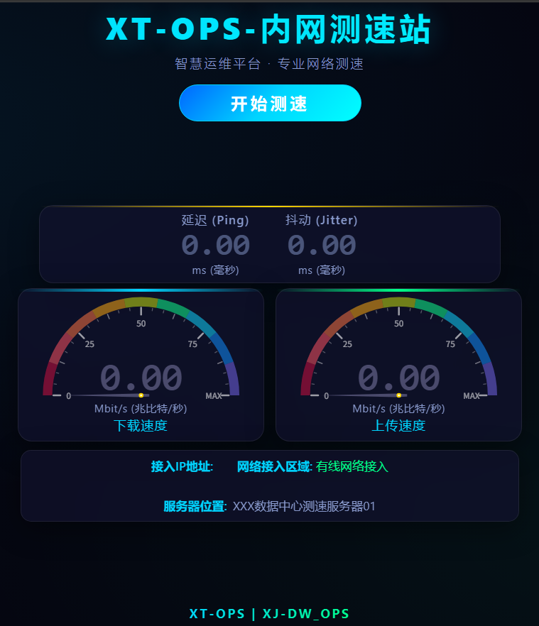
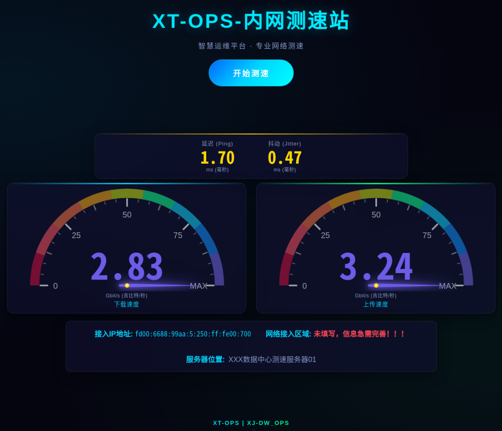

<div align="center">

# XT-OPS 智慧运维平台 · 专业网络测速

### 企业级内网测速系统 · 单Docker镜像 · 纯离线运行 · 等保2.0合规

<span style="display:inline-block;background:#00D4FF;color:#000;font-weight:bold;padding:4px 12px;border-radius:4px;margin:2px;font-size:13px;">版本 v202609300000</span>

<span style="display:inline-block;background:#2496ED;color:#fff;font-weight:bold;padding:4px 12px;border-radius:4px;margin:2px;font-size:13px;">部署 Docker</span>
<span style="display:inline-block;background:#76B900;color:#fff;font-weight:bold;padding:4px 12px;border-radius:4px;margin:2px;font-size:13px;">架构 AMD64+ARM64</span>
<span style="display:inline-block;background:#777BB4;color:#fff;font-weight:bold;padding:4px 12px;border-radius:4px;margin:2px;font-size:13px;">PHP 8.1</span>
<span style="display:inline-block;background:#003545;color:#fff;font-weight:bold;padding:4px 12px;border-radius:4px;margin:2px;font-size:13px;">MariaDB 10.6</span>

**为政企、军工、能源、金融等高度安全敏感行业量身打造的内网网络性能测速与终端资产管理平台**

</div>

---

## 📋 目录

- [一、产品概述](#一产品概述)
- [二、核心特性](#二核心特性)
- [三、系统架构](#三系统架构)
- [四、功能全景](#四功能全景)
- [五、视觉展示](#五视觉展示)
- [六、安全体系](#六安全体系)
- [七、部署指南](#七部署指南)
- [八、配置说明](#八配置说明)
- [九、技术规格](#九技术规格)
- [十、适用场景](#十适用场景)
- [十一、联系我们](#十一联系我们)

---

## 一、产品概述

> **一句话定位**：把网络测速从"运维人员的工具"升级为"管理层的决策依据"。

### 1.1 我们解决什么问题

| 痛点 | 传统方案 | XT-OPS 方案 |
|:----:|:--------:|:-----------:|
| 内网测速需要互联网连接 | 依赖公网测速站，数据外泄 | **纯离线运行**，零互联网请求 |
| 测速结果无法留存分析 | 截图人工统计，效率低下 | **自动入库+可视化大屏**，实时趋势分析 |
| 终端资产信息采集困难 | 人工登记MAC/IP，容易遗漏 | **测速时自动采集**，终端信息一键获取 |
| 权限管控缺失 | 所有人都能看所有数据 | **三角色权限体系**，数据分级管控 |
| 操作无审计追溯 | 出问题无法定位责任人 | **全操作审计日志**，50+种操作类型记录 |
| 部署复杂依赖多 | 装Nginx+PHP+MySQL+前端一堆依赖 | **单Docker镜像**，一条命令完成部署 |
| 国产OS兼容性差 | CentOS/Ubuntu才能跑 | **UOS/麒麟/统信全面适配**，ARM64原生支持 |

### 1.2 产品定位

```
┌─────────────────────────────────────────────────────────────────┐
│                                                                 │
│   传统测速工具          XT-OPS 智慧运维平台                     │
│                                                                 │
│   × 一次性测速          ✓ 持续性网络性能监测                   │
│   × 结果不留存          ✓ 测速数据自动入库+趋势分析            │
│   × 无资产管理          ✓ 终端IP/MAC/OS自动采集建档            │
│   × 无权限控制          ✓ 三角色分级权限+审计日志              │
│   × 需要互联网          ✓ 纯离线运行+零外联设计                │
│   × 部署复杂            ✓ 单镜像一键部署                       │
│                                                                 │
│   从"工具"到"平台"的跨越                                       │
│                                                                 │
└─────────────────────────────────────────────────────────────────┘
```

### 1.3 核心数据指标

| 指标 | 数值 | 说明 |
|:----:|:----:|:-----|
| 代码版本 | v202609300000 | 全新初始化基线 |
| 随机特效 | 110+ 种 | 测速完成时的庆祝动画 |
| 大屏布局 | 7 种内置 | L型/全宽/左右交换等异型布局 |
| 主题风格 | 6 种 | 科幻蓝/缅怀黑/科技绿/暗夜紫/暖阳橙/极简白 |
| 审计操作类型 | 50+ 种 | 全中文标签映射，全覆盖 |
| 敏感词库 | 170 条 | DFA算法实时过滤 |
| IP映射规则 | 12 条 | 自动检测冲突+一键修复 |
| 角色权限 | 54 条 | admin/operator/auditor 三角色18×3 |
| 数据库表 | 13 张 | 测速/终端/审计/配置/权限全覆盖 |

---

## 二、核心特性

### 2.1 纯离线运行 · 零外联设计

```
  ┌──────────┐     CSP connect-src 'self'     ┌──────────────┐
  │          │ ◄─────────────────────────────── │              │
  │  浏览器   │     禁止任何外部请求             │  内网服务器   │
  │          │ ──────────────────────────────► │              │
  └──────────┘     所有请求仅限内网             └──────────────┘
```

- **CSP协议层阻断**：`Content-Security-Policy` 中 `connect-src 'self'` 从浏览器层面禁止任何外联
- **零互联网请求**：不依赖任何公网CDN、API、字体库，全部资源内置
- **离线SSL证书**：自签名证书有效期至7502年，含SAN多IP支持
- **内网NAT穿透**：WebRTC自报告真实IP + 终端Agent采集MAC + NAT类型检测

### 2.2 单Docker镜像 · 交互式一键部署

```bash
# 执行交互式部署脚本，7步向导自动完成全部部署
chmod +x xtops_deploy.sh
./xtops_deploy.sh
```

部署脚本自动完成7步：
1. **系统环境检测** — OS识别/Docker版本/磁盘空间/端口占用全面体检
2. **Docker检测** — 自动检测Docker是否安装，未安装则给出国产OS离线安装指导
3. **镜像加载** — 自动查找并加载 `xt-ops-speedtest-v*.tar.gz` 镜像包
4. **配置输入** — 交互式输入端口/管理员密码/IP白名单（均有默认值，回车即用）
5. **容器启动** — `--network host` 模式启动，自动传环境变量
6. **服务就绪** — 等待数据库初始化完成，健康检查通过
7. **部署验证** — 自动验证HTTPS访问/数据库连接/管理员登录

- **全栈内置**：Nginx + PHP-FPM + MariaDB + 前端代码 + SSL证书，全部打包在单一镜像中
- **双架构支持**：AMD64 (x86_64) + ARM64 (AArch64)，自动检测CPU架构
- **国产OS适配**：UOS/麒麟/统信/openEuler/Anolis/TencentOS全适配，含离线安装指导
- **网络模式**：`--network host` 直接使用宿主机网络，无需端口映射

### 2.3 汽车仪表盘 · 专业视觉

测速界面采用**汽车仪表盘风格**设计，半圆弧+三级刻度+动态指针+9段色阶分区：

| 视觉元素 | 规格 | 说明 |
|:--------:|:----:|:-----|
| 色环 | 9段色阶 | 深红→红→橙→黄→黄绿→绿→青→蓝→蓝紫，平滑过渡 |
| 刻度 | 三级层次 | 主刻度/次刻度/次次刻度，密集均匀分布 |
| 指针 | 细长针+配重尾 | 5点polygon锥形设计，发光效果，实时旋转 |
| 数字 | 自适应字号 | 速率数字随色环空间动态计算，覆盖轴心 |
| 联动 | 三者同步 | 指针/刻度/数字共用9段speedToColor分色函数 |

### 2.4 三角色权限 · 等保2.0合规

```
  ┌─────────────────────────────────────────────────┐
  │                 权限体系架构                      │
  │                                                 │
  │  ┌─────────┐  ┌──────────┐  ┌──────────┐      │
  │  │  admin   │  │ operator │  │ auditor  │      │
  │  │ 系统管理员│  │ 操作员    │  │ 审计员    │      │
  │  └────┬────┘  └─────┬────┘  └─────┬────┘      │
  │       │              │              │            │
  │  全部权限18条   日常操作18条   只读审计18条     │
  │  (含系统配置)   (不含系统配置)  (仅查看+审计)   │
  └─────────────────────────────────────────────────┘
```

- **admin（系统管理员）**：全部18项权限，含系统配置、用户管理、IP映射、触发器管理
- **operator（操作员）**：日常操作18项权限，不含系统级配置
- **auditor（审计员）**：只读权限18项，专注审计日志查看与数据导出
- **权限检查函数**：`requirePermission()` 基于 `xtops_role_permissions` 表逐API鉴权
- **Session安全**：`cookie_secure=1`，HTTPS-only，超时可配置

### 2.5 实时数据大屏 · 决策支撑

| 功能 | 说明 |
|:----:|:-----|
| 7种内置布局 | L型/全宽/左右交换/上下分割等异型grid-template-areas |
| 6种主题风格 | 科幻蓝/缅怀黑/科技绿/暗夜紫/暖阳橙/极简白 |
| 配置跟随账户 | 每人独立配置存数据库，跨终端自动同步 |
| 固化默认大屏 | admin可固化当前配置为全局默认，一键恢复 |
| 时间范围切换 | 近1天(按小时)/近5天/近10天/近1月(按月)/自定义 |
| 图表类型 | 折线/面积/柱状/饼图/环形/横向柱状/多系列/多指标 |
| 智能自适应 | 颜色/位置/边距随数据量动态伸缩，禁止固定阈值 |
| 黄金角配色 | 137.508°递增色相+饱和度/亮度变化，高区分度 |

---

## 三、系统架构

### 3.1 整体架构

```
┌──────────────────────────────────────────────────────────────────┐
│                    xt-ops-speedtest Docker Container              │
│                                                                  │
│  ┌──────────────┐    ┌───────────────┐    ┌──────────────┐      │
│  │   Nginx      │───►│   PHP-FPM     │───►│  MariaDB     │      │
│  │  :8009(SSL)  │    │    8.1        │    │   10.6       │      │
│  │  :8080(HTTP) │    │               │    │              │      │
│  └──────┬───────┘    └───────────────┘    └──────────────┘      │
│         │                                                        │
│  ┌──────▼──────────────────────────────────────────────┐        │
│  │                    前端资源                          │        │
│  │  index.html (测速主页面)                            │        │
│  │  dashboard.html (管理大屏)                          │        │
│  │  xtops_panel_merged.js (大屏引擎)                   │        │
│  └─────────────────────────────────────────────────────┘        │
│                                                                  │
│  ┌──────────────────────────────────────────────────────┐        │
│  │                    后端API                           │        │
│  │  admin_api.php (管理API+权限检查)                   │        │
│  │  dashboard_api.php (大屏数据)                       │        │
│  │  telemetry.php (测速数据入库)                       │        │
│  │  report_terminal.php (终端信息上报)                 │        │
│  │  xtops_collect_download.php (采集脚本生成)          │        │
│  └─────────────────────────────────────────────────────┘        │
│                                                                  │
└──────────────────────────────────────────────────────────────────┘
                              │
                              ▼
                    ┌─────────────────┐
                    │   浏览器终端     │
                    │  PC/手机/平板    │
                    └─────────────────┘
```

### 3.2 数据流架构

```
  测速终端                    内网服务器                    管理大屏
     │                            │                           │
     │  1.访问测速页面            │                           │
     │ ──────────────────────────►│                           │
     │                            │                           │
     │  2.下载采集脚本(.bat/.sh)  │                           │
     │ ◄──────────────────────────│                           │
     │                            │                           │
     │  3.执行采集(IP+MAC+OS)     │                           │
     │ ──────────┐                │                           │
     │            │                │                           │
     │  4.上报终端信息            │                           │
     │ ──────────────────────────►│                           │
     │                            │  5.入库terminal_info      │
     │                            │                           │
     │  6.执行测速(下载/上传)     │                           │
     │ ──────────────────────────►│                           │
     │                            │  7.入库speedtest_users    │
     │                            │                           │
     │                            │  8.大屏实时查询展示       │
     │                            │ ──────────────────────────►│
     │                            │                           │
```

### 3.3 数据库表结构

| 表名 | 用途 | 类型 |
|:-----|:-----|:----:|
| `speedtest_users` | 测速记录（下载/上传/延迟/抖动/IP/ISP等） | 业务 |
| `terminal_info` | 终端信息（IP/MAC/OS/组织归属） | 业务 |
| `xtops_audit_logs` | 审计日志（50+种操作类型，全中文标签） | 业务 |
| `speedtest_admins` | 管理员账户（bcrypt加密） | 配置 |
| `speedtest_settings` | 系统设置（35条配置项） | 配置 |
| `xtops_dashboard_user_config` | 大屏配置（跟随账户+`__default__`默认） | 配置 |
| `xtops_role_permissions` | 角色权限（三角色×18项=54条） | 配置 |
| `xtops_ip_map` | IP映射规则（12条，自动冲突检测） | 配置 |
| `xtops_dfa_words` | 敏感词库（170条，DFA算法过滤） | 配置 |
| `xtops_dfa_categories` | 敏感词分类（4类） | 配置 |
| `xtops_triggers` | 触发器配置（6条，全启用） | 配置 |
| `xtops_syslog_targets` | 系统日志目标 | 配置 |
| `xtops_time_config` | 时间配置 | 配置 |

---

## 四、功能全景

### 4.1 测速功能

| 功能 | 说明 |
|:----:|:-----|
| 下载测速 | HTTP多线程下载，garbage.php生成无限数据流 |
| 上传测速 | HTTP多线程上传，empty.php接收并丢弃 |
| 延迟测试 | HTTP小包往返延迟测量 |
| 抖动测试 | 延迟标准差计算 |
| 实时仪表盘 | 汽车仪表盘风格，指针实时旋转，9段色阶分区 |
| 速率方块 | 下载/上传速率实时方块动画，贴边布局 |
| 110+特效 | 测速完成时随机触发庆祝动画 |
| WebRTC | NAT穿透，获取真实内网IP |
| 多线程 | 可配置并发线程数，充分利用带宽 |

### 4.2 终端采集

| 平台 | 采集方式 | 采集内容 |
|:----:|:--------:|:---------|
| Windows | 下载.bat → PowerShell执行 | IP + MAC + OS + 主机名 |
| Linux | 下载.sh → bash执行 | IP + MAC + OS + 主机名 |
| macOS | 下载.sh → bash执行 | IP + MAC + OS + 主机名 |
| 移动端 | WebRTC + REMOTE_ADDR | IP（MAC留空） |

- **采集流程**：测速页面自动下载采集脚本 → 终端本地执行 → 上报到 `report_terminal.php`
- **超时机制**：轮询120秒等待采集成功，超时后直接开始测速
- **安全传输**：通过 `admin_api.php` 安全传输，不暴露敏感采集页面

### 4.3 管理大屏

| 卡片 | 类型 | 说明 |
|:----:|:----:|:-----|
| 总测速次数 | 指标卡 | 实时统计 |
| 平均下载速度 | 指标卡 | 4位精度 |
| 平均上传速度 | 指标卡 | 4位精度 |
| 平均延迟 | 指标卡 | 4位精度 |
| 国产OS占比 | 饼图 | UOS/麒麟/统信等 |
| IPv6占比 | 饼图 | 协议分布 |
| 速度趋势 | 折线图 | 时间范围可切换 |
| 操作系统分布 | 横向柱状图 | 按数量降序 |
| 审计操作分布 | 横向柱状图 | 30种操作类型 |
| 终端统计 | 多指标卡 | 支持折线/面积模式切换 |
| 测速记录列表 | 弹窗表格 | 可分页查看全部记录 |

### 4.4 管理后台

| 功能 | 说明 |
|:----:|:-----|
| 登录认证 | bcrypt密码 + 验证码 + Session安全 |
| 测速记录 | 分页/筛选/导出，含终端信息关联 |
| 终端管理 | IP/MAC/OS/组织归属，支持编辑 |
| 审计日志 | 50+种操作类型，全中文标签，支持搜索 |
| 用户管理 | 三角色增删改，权限矩阵配置 |
| 系统设置 | 35条配置项，在线编辑 |
| IP映射 | 12条规则，自动冲突检测+一键修复 |
| 敏感词管理 | 170条DFA敏感词，4分类 |
| 触发器管理 | 6条触发器，启用/禁用 |
| 文档管理 | 在线文档编辑/下载 |
| 大屏配置 | 7布局×6主题，配置跟随账户 |

### 4.5 安全审计

| 功能 | 说明 |
|:----:|:-----|
| 审计日志 | 50+种操作类型，全中文标签映射 |
| 操作记录 | 登录/登出/增删改/导出/配置全记录 |
| 日志搜索 | 按操作类型/时间/用户/关键词搜索 |
| 日志导出 | 支持导出审计日志 |
| 后端集中映射 | `getAuditActionLabel()` 后端统一维护中文标签 |

---

## 五、视觉展示

### 5.1 测速首页 · 汽车仪表盘

<div align="center">

**下载/上传双仪表盘 · 半圆弧+三级刻度+动态指针+9段色阶**





</div>

**视觉规格**：

```
  ┌─────────────────────────────────────────────┐
  │              下载速度 仪表盘                 │
  │                                             │
  │          ╭─────────────────────╮            │
  │         ╱   ╱─────╲   ╱─────╲  ╲           │
  │        │  │ 9段色阶 │ │刻度数字│  │          │
  │        │  ╲─────────╱ ╲────────╱  │         │
  │        │      ╲    指针   ╱      │         │
  │        │       ╲    ╱              │        │
  │         ╲      ╲──╱              ╱         │
  │          ╲─────────────────────╱            │
  │                                             │
  │              123.4567 Mbps                  │
  │              下载速度                       │
  └─────────────────────────────────────────────┘
```

| 设计要素 | 实现规格 |
|:--------:|:---------|
| 色环 | 9段色阶：深红→红→橙→黄→黄绿→绿→青→蓝→蓝紫 |
| 刻度 | 三级层次：主刻度(13px) / 次刻度(9px) / 次次刻度(5px) |
| 指针 | 5点polygon锥形：细长针(宽3px) + 配重尾(宽2px) + 发光效果 |
| 数字 | 自适应字号，随色环空间动态计算，覆盖轴心 |
| 联动 | 指针/刻度/数字共用 `speedToColor()` 9段分色函数 |
| 标签 | "下载速度"/"上传速度" 使用 `var(--primary)` #00D4FF |

### 5.2 管理大屏 · 数据可视化

<div align="center">

**7种布局 × 6种主题 · 配置跟随账户 · 跨终端同步**

</div>

| 主题 | 风格 | 适用场景 |
|:----:|:-----|:---------|
| 科幻蓝 | 深蓝背景+青色主调 | 科技企业、数据中心 |
| 缅怀黑 | 纯黑#000000+白色主文字 | 肃穆场合、夜间值班 |
| 科技绿 | 深绿背景+亮绿主调 | 环保能源、监控系统 |
| 暗夜紫 | 深紫背景+紫色主调 | 创意企业、设计部门 |
| 暖阳橙 | 暖色背景+橙色主调 | 温馨场景、日常办公 |
| 极简白 | 白色背景+深色主调 | 打印输出、正式报告 |

### 5.3 多端适配

```
  ┌─────────┐    ┌─────────┐    ┌─────────┐    ┌─────────┐
  │  手机    │    │  平板    │    │  PC     │    │ 大屏TV  │
  │ 375px   │    │ 768px   │    │ 1920px  │    │ 4K/8K   │
  │         │    │         │    │         │    │         │
  │ 单列    │    │ 双列    │    │ 多列    │    │ 全展开  │
  │ 响应式  │    │ 响应式  │    │ 响应式  │    │ 响应式  │
  └─────────┘    └─────────┘    └─────────┘    └─────────┘
```

- **移动端**：单列布局，仪表盘自适应缩放，触摸操作优化
- **平板端**：双列布局，兼顾信息密度与可读性
- **PC端**：多列布局，最大1120px内容宽度，双仪表盘并排
- **大屏TV**：全展开布局，支持4K/8K超宽屏，仪表盘铺满

---

## 六、安全体系

### 6.1 安全架构

```
  ┌─────────────────────────────────────────────────────────┐
  │                    安全防护层级                          │
  │                                                         │
  │  第1层  ──  网络层  ──  Nginx deny规则(敏感文件403)    │
  │  第2层  ──  协议层  ──  CSP策略(阻断外联)              │
  │  第3层  ──  传输层  ──  HTTPS-only(cookie_secure=1)    │
  │  第4层  ──  应用层  ──  Session认证+CSRF防护            │
  │  第5层  ──  权限层  ──  requirePermission()逐API鉴权   │
  │  第6层  ──  数据层  ──  SQL预处理+XSS转义+DFA过滤      │
  │  第7层  ──  审计层  ──  全操作日志+50+种操作类型       │
  │                                                         │
  └─────────────────────────────────────────────────────────┘
```

### 6.2 安全特性清单

| 安全特性 | 实现方式 | 验证状态 |
|:--------:|:---------|:--------:|
| CSP策略 | `connect-src 'self'` 阻断外联 | ✅ 已验证 |
| 敏感文件保护 | Nginx deny speedtest.js/worker.js返回403 | ✅ 已验证 |
| Session安全 | `cookie_secure=1`，HTTPS-only，超时可配置 | ✅ 已验证 |
| 密码加密 | bcrypt哈希存储 | ✅ 已验证 |
| SQL注入防护 | 全部使用预处理语句 | ✅ 已验证 |
| XSS防护 | 输出转义 + CSP `script-src 'self'` | ✅ 已验证 |
| 路径遍历防护 | 文件路径白名单检查 | ✅ 已验证 |
| 未授权访问 | `requirePermission()` 逐API鉴权 | ✅ 已验证 |
| DFA敏感词过滤 | 170条敏感词，4分类，实时过滤 | ✅ 已验证 |
| 审计日志 | 50+种操作类型，全中文标签 | ✅ 已验证 |
| 验证码 | 登录页图形验证码 | ✅ 已验证 |
| CORS限制 | 同源限制，禁止跨域 | ✅ 已验证 |

### 6.3 权限矩阵

| 功能模块 | admin | operator | auditor |
|:--------:|:-----:|:--------:|:-------:|
| 测速记录查看 | ✅ | ✅ | ✅ |
| 终端信息管理 | ✅ | ✅ | ✅ |
| 审计日志查看 | ✅ | ✅ | ✅ |
| 大屏配置 | ✅ | ✅ | ✅ |
| 固化默认大屏 | ✅ | ❌ | ❌ |
| 用户管理 | ✅ | ❌ | ❌ |
| 系统设置 | ✅ | ❌ | ❌ |
| IP映射管理 | ✅ | ❌ | ❌ |
| 敏感词管理 | ✅ | ❌ | ❌ |
| 触发器管理 | ✅ | ❌ | ❌ |
| 数据导出 | ✅ | ✅ | ✅ |
| 文档管理 | ✅ | ✅ | ❌ |

---

## 七、部署指南

### 7.1 环境要求

| 项目 | 最低要求 | 推荐 |
|:----:|:---------|:-----|
| 操作系统 | Linux 3.10+ | UOS/麒麟/CentOS/Ubuntu |
| CPU架构 | x86_64 或 ARM64 | — |
| 内存 | 512MB | 2GB+ |
| 磁盘 | 1GB | 10GB+（数据持久化） |
| Docker | 20.10+ | 最新稳定版 |
| 网络 | 内网可达 | — |

### 7.2 快速部署

```bash
# 第1步：将镜像包和部署脚本放在同一目录
# xt-ops-speedtest-v*.tar.gz  +  xtops_deploy.sh

# 第2步：执行交互式部署脚本
chmod +x xtops_deploy.sh
./xtops_deploy.sh

# 第3步：按向导提示输入配置（均有默认值，回车即用）
#  - 部署端口（默认8009）
#  - 管理员密码（自动生成或自定义）
#  - IP白名单（默认不限）
# 脚本自动完成：环境检测→镜像加载→容器启动→服务就绪→验证

# 第4步：访问测速站
# 浏览器打开 https://<服务器IP>:8009
```

### 7.3 验证部署

```bash
# 检查容器状态
docker ps | grep xt-ops-speedtest

# 检查服务端口
docker exec xt-ops-speedtest ss -tlnp | grep 8009

# 检查数据库
docker exec xt-ops-speedtest mysql -uxtops -pxtops123 \
  xtops_speedtest -e "SELECT COUNT(*) FROM speedtest_admins;"
```

### 7.4 默认账户

| 用户名 | 角色 | 默认密码 | 说明 |
|:------:|:----:|:---------|:-----|
| sysadmin | admin | `xtops@2026` | 系统管理员，全部权限 |
| secadmin | operator | `xtops@2026` | 操作员，日常操作权限 |
| auditadmin | auditor | `xtops@2026` | 审计员，只读审计权限 |

> ⚠️ **安全提示**：首次登录后请立即修改默认密码！

---

## 八、配置说明

### 8.1 端口配置

| 端口 | 协议 | 用途 |
|:----:|:----:|:-----|
| 8009 | HTTPS | 生产环境（SSL加密） |
| 8080 | HTTP | 调试环境（仅内网） |

### 8.2 数据持久化

部署脚本 `xtops_deploy.sh` 在交互式向导中会提示选择数据持久化方式：

- **Docker Volume（推荐）**：`-v mysql_data:/var/lib/mysql`，Docker管理卷，容器删除数据不丢失
- **宿主机目录**：`-v /data/speedtest:/var/lib/mysql`，直接挂载宿主机目录

脚本自动处理卷挂载，无需手动指定。

### 8.3 系统设置项

| 设置项 | 说明 | 默认值 |
|:-------|:-----|:-------|
| session_timeout | 会话超时(秒) | 0(永不超时) |
| verify_code | 验证码开关 | 开启 |
| ip_whitelist | IP白名单 | 空(不限) |
| max_concurrent | 最大并发测速 | 不限 |
| telemetry_level | 数据采集级别 | 完整 |

---

## 九、技术规格

### 9.1 技术栈

| 层级 | 技术 | 版本 | 说明 |
|:----:|:-----|:----:|:-----|
| 前端 | HTML5 + CSS3 + JavaScript | — | 原生开发，无框架依赖 |
| 后端 | PHP-FPM | 8.1 | 高性能FastCGI |
| 数据库 | MariaDB | 10.6 | MySQL兼容，高性能 |
| Web服务器 | Nginx | — | 高并发，低内存 |
| 容器 | Docker | 20.10+ | 单镜像部署 |
| 测速核心 | LibreSpeed | 深度定制 | 多线程HTTP测速 |

### 9.2 性能指标

| 指标 | 数值 | 说明 |
|:----:|:----:|:-----|
| 容器启动 | <1秒 | 数据库预初始化 |
| 内存占用 | ~100MB | 空载状态 |
| 并发测速 | 100+ | 同时在线测速 |
| 数据写入 | <10ms | 单条测速记录入库 |
| 大屏刷新 | <500ms | 全量数据查询 |

### 9.3 兼容性

| 操作系统 | 架构 | 状态 |
|:--------:|:----:|:----:|
| UOS 统信 | x86_64 | ✅ 已验证 |
| UOS 统信 | ARM64 | ✅ 已验证 |
| 麒麟 OS | x86_64 | ✅ 已验证 |
| 麒麟 OS | ARM64 | ✅ 已验证 |
| CentOS 7+ | x86_64 | ✅ 兼容 |
| Ubuntu 20+ | x86_64 | ✅ 兼容 |
| Ubuntu 20+ | ARM64 | ✅ 兼容 |
| Debian 11+ | x86_64 | ✅ 兼容 |

---

## 十、适用场景

### 10.1 行业应用

| 行业 | 场景 | 价值 |
|:----:|:-----|:-----|
| **政府机关** | 内网网络性能监测 | 不连互联网，合规测速 |
| **军工单位** | 封闭网络质量评估 | 纯离线运行，零外联 |
| **能源电力** | 变电站网络巡检 | 终端资产自动采集 |
| **金融银行** | 网点网络质量监控 | 审计日志全记录 |
| **大型企业** | 总部-分支网络监测 | 多终端统一管理 |
| **教育科研** | 校园网性能评估 | 可视化数据大屏 |
| **医疗机构** | 内网PACS网络测速 | 离线安全测速 |
| **数据中心** | 内部网络质量监测 | 实时趋势分析 |

### 10.2 核心价值

```
  ┌─────────────────────────────────────────────────────┐
  │                                                     │
  │   合规价值          安全价值          管理价值       │
  │                                                     │
  │   纯离线运行        零外联设计        三角色权限     │
  │   等保2.0合规       CSP协议阻断      审计全记录     │
  │   数据不出网        敏感文件保护     操作可追溯     │
  │                                                     │
  │   效率价值          成本价值          体验价值       │
  │                                                     │
  │   一键部署          单镜像架构        汽车仪表盘     │
  │   自动采集          无需买多套软件    110+特效       │
  │   实时大屏          零运维成本       多端适配       │
  │                                                     │
  └─────────────────────────────────────────────────────┘
```

### 10.3 ROI分析

| 投入项 | 传统方案 | XT-OPS方案 | 节省 |
|:------:|:---------|:-----------|:-----|
| 软件采购 | 多套工具组合 | 单一平台 | 60%+ |
| 部署人力 | 3-5人天 | 0.5人天 | 90% |
| 运维成本 | 持续投入 | 近零运维 | 95% |
| 培训成本 | 多系统培训 | 统一界面 | 70% |
| 合规成本 | 额外加固 | 内置合规 | 80% |

---

## 十一、联系我们

<div align="center">

**XT-OPS 智慧运维平台 · 专业网络测速**

**企业级内网测速系统 · 单Docker镜像 · 纯离线运行 · 等保2.0合规**

---

| 联系项 | 信息 |
|:------:|:-----|
| 产品咨询 | 请联系销售团队获取详细报价方案 |
| 技术支持 | 包含部署指导、配置优化、定制开发 |
| 售后服务 | 含版本升级、BUG修复、安全更新 |
| 定制开发 | 支持功能定制、界面定制、集成对接 |

---

> **选择 XT-OPS，选择专业、安全、可靠的内网测速解决方案。**

</div>

---

<div align="center">
<sub>© 2026 XT-OPS Team. All rights reserved.</sub>
<br>
<sub>版本 v202609300000 | 基于LibreSpeed深度定制</sub>
</div>